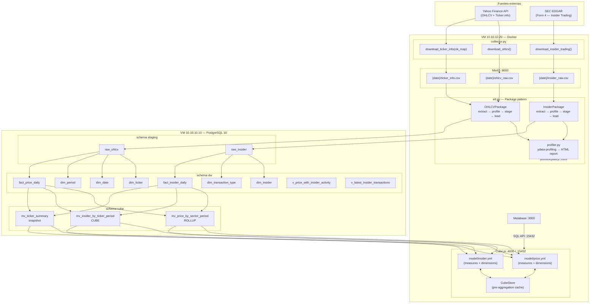

# Arquitectura — Monolithic Data Warehouse

> Stack: PostgreSQL 16 · MinIO · Cube.js · Metabase · Python 3.12 · Docker Compose

---

## Infraestructura física

```
     VM: 10.10.10.10                    VM: 10.10.10.20
   ┌──────────────────┐              ┌──────────────────────────────────────┐
   │  PostgreSQL 16   │              │  Docker Compose                      │
   │  (bare metal)    │◄─────────────┤                                      │
   │                  │  :5432       │  ┌─────────────┐  ┌───────────────┐  │
   │  schema staging  │              │  │   Cube.js   │  │   Metabase    │  │
   │  schema dw       │◄─────────────┤  │   :4000     │  │   :3000       │  │
   │  schema cube     │  :5432       │  │   SQL :15432│  │               │  │
   │  schema profiling│              │  └─────────────┘  └───────────────┘  │
   │                  │              │                                       │
   └──────────────────┘              │  ┌─────────────┐  ┌───────────────┐  │
                                     │  │    MinIO    │  │  CubeStore    │  │
                                     │  │ :9000/:9001 │  │  (interno)    │  │
                                     │  └─────────────┘  └───────────────┘  │
                                     │                                       │
                                     │  ┌─────────────┐  ┌───────────────┐  │
                                     │  │  collector  │  │     etl       │  │
                                     │  │  (pipeline) │  │  (pipeline)   │  │
                                     │  └─────────────┘  └───────────────┘  │
                                     └──────────────────────────────────────┘
```

`collector` y `etl` son servicios de `profile: pipeline` — solo corren bajo demanda, no como daemons.

---

## Diagrama de capas completo



---

## Stack tecnológico

| Capa | Tecnología | VM | Notas |
|---|---|---|---|
| Extracción | Python + `yfinance` + `requests` | 10.10.10.20 (Docker) | Sin auth, rate limiting propio en SEC |
| Landing | MinIO S3-compatible | 10.10.10.20 (Docker) | Raw inmutable, particionado `{date}/` |
| Profiling | `ydata-profiling` 4.9 | 10.10.10.20 (Docker) | HTML por run, mount en `./profiles/` |
| Staging | PostgreSQL TEXT tables | 10.10.10.10 | TRUNCATE+COPY cada run, sin constraints |
| Transformación | Python + psycopg2 | 10.10.10.20 (Docker) | CTEs + window functions en SQL |
| Warehouse | PostgreSQL 16 | 10.10.10.10 | PKs + FKs + CHECKs — requerimiento del curso |
| Pre-agregación | Materialized Views (ROLLUP/CUBE) | 10.10.10.10 | Backend que Cube.js consulta |
| Semantic layer | Cube.js | 10.10.10.20 (Docker) | Caching, pre-aggregations, SQL API |
| Visualización | Metabase | 10.10.10.20 (Docker) | Conecta a Cube.js SQL API :15432 |
| Scheduler MVs | `pg_cron` | 10.10.10.10 | Refresh diario 06:30–06:40 |

---

## Modelo de datos — Star Schema

```
                    ┌─────────────────┐
                    │   dim_date      │
                    │ PK: date_id     │
                    │ full_date       │
                    │ year, quarter   │
                    │ month, week     │
                    │ day_of_week     │
                    │ is_trading_day  │
                    └────────┬────────┘
                             │ FK
         ┌───────────────────┼───────────────────┐
         │                   │                   │
┌────────┴──────┐   ┌────────┴──────────┐   ┌───┴──────────────────┐
│  dim_ticker   │   │ fact_price_daily  │   │ fact_insider_daily   │
│ PK: ticker_id │◄──┤ PK: ticker_id     ├──►│ PK: ticker_id        │
│ symbol UNIQUE │   │     date_id       │   │     date_id          │
│ company_name  │   │     period_id     │   │     insider_id       │
│ sector        │   │ open, high        │   │     transaction_type │
│ sec_cik       │   │ low, close        │   │ shares_total         │
└───────────────┘   │ adj_close, volume │   │ price_per_share      │
                    │ daily_return      │   │ total_value          │
┌───────────────┐   │ pct_change        │   │ shares_owned_after   │
│  dim_period   │◄──┤ rolling_30d_vol   │   │ accession_number     │
│ '1d','1wk'... │   └───────────────────┘   └──────────┬───────────┘
└───────────────┘                                       │ FK × 2
                    ┌───────────────┐  ┌────────────────┴──────────┐
                    │  dim_insider  │  │  dim_transaction_type     │
                    │ PK: insider_id│  │  PK: transaction_type_id  │
                    │ reporter_cik  │  │  code (P,S,A,M,F...)      │
                    │ reporter_name │  │  direction (buy/sell/      │
                    │ title         │  │            neutral)        │
                    │ is_director   │  │  is_open_market            │
                    └───────────────┘  └───────────────────────────┘
```

**Dimensiones conformadas**: `dim_ticker` y `dim_date` son referenciadas por ambas facts, habilitando JOINs cruzados directos (precio del día + actividad insider del día).

---

## Flujo de datos detallado

### MinIO — particionado por fecha

```
raw-ohlcv/
└── 2026-05-28/
    ├── ohlcv_raw.csv     ticker, trade_date, open, high, low, close, adj_close, volume
    ├── ticker_info.csv   symbol, company_name, sector, industry, exchange,
    │                     currency, country, market_cap_cat, sec_cik
    └── insider_raw.csv   accession_number, filing_date, issuer_cik, issuer_ticker,
                          issuer_name, reporter_cik, reporter_name, reporter_title,
                          is_director, is_officer, is_ten_pct_owner,
                          transaction_date, transaction_code, security_title,
                          shares, price_per_share, acquired_disposed, shares_owned_after
```

Cada run del collector escribe en `{date}/`. El ETL lee `PARTITION_DATE` (default: hoy).  
**El histórico queda en MinIO** — el DW solo guarda el último estado de cada hecho (UPSERT).

### Package pattern — flujo por fuente

```
MinIO CSV
    │
    ▼ extract()
DataFrame en memoria
    │
    ▼ profile()          → profiles/{date}/{name}.html
    │                      warnings: lista de strings
    │                      critical: raise ValueError → aborta el package
    ▼ stage()
TRUNCATE + COPY → staging.raw_*
    │
    ▼ load()
    ├─ populate_dim_*    (UPSERT con ON CONFLICT DO UPDATE)
    └─ populate_fact_*   (UPSERT con ON CONFLICT DO UPDATE)
```

### Transformaciones clave

**`fact_price_daily`** — window functions en tabla temporal:

```
adj_close  →  daily_return    = adj_close - LAG(adj_close)  PARTITION BY ticker_id
adj_close  →  pct_change      = (adj_close / LAG(adj_close)) - 1
pct_change →  rolling_30d_vol = STDDEV(pct_change) ROWS BETWEEN 29 PRECEDING AND CURRENT ROW
```

**`fact_insider_daily`** — agregación diaria (grain: ticker × día × insider × tipo):

```
shares_total     = SUM(shares)
price_per_share  = promedio ponderado (Σ price×shares / Σ shares donde price IS NOT NULL)
total_value      = shares_total × price_per_share
shares_owned_after = MAX(shares_owned_after)
accession_number   = MAX(accession_number) — último filing del día
```

### Staging — contrato de la zona raw

| Tabla | Propósito | Ciclo de vida |
|---|---|---|
| `staging.raw_ohlcv` | OHLCV en TEXT sin constraints | TRUNCATE + COPY en cada run |
| `staging.raw_insider` | Form 4 en TEXT sin constraints | TRUNCATE + COPY en cada run |

Todas las columnas son TEXT para evitar errores de casteo en datos sucios. El tipado ocurre en las CTEs del INSERT final al DW.

---

## Capa Cube — Materializadas + Cube.js

### Materialized Views en PostgreSQL (pre-agregación base)

```
schema cube (en 10.10.10.10)
├── mv_price_by_sector_period   — ROLLUP(sector, year, quarter, month)
│   Uso: rendimiento y volatilidad histórica por sector y período
│
├── mv_insider_by_ticker_period — CUBE(symbol, direction, year, month)
│   Uso: presión compradora/vendedora, todas las combinaciones dim posibles
│
└── mv_ticker_summary           — snapshot por ticker
    Uso: dashboard ejecutivo, scatter riesgo/retorno, KPIs
```

Refresh strategy: `REFRESH MATERIALIZED VIEW CONCURRENTLY` (requiere UNIQUE INDEX en cada MV).  
Automatizado con `pg_cron` a las 06:30–06:40, override manual vía `make refresh`.

### Cube.js — semantic layer sobre las MVs + facts

Cube.js se configura para apuntar a `10.10.10.10:5432` y expone:

- **REST API** en `:4000` — para integraciones futuras
- **SQL API** en `:15432` — Metabase conecta aquí como si fuera PostgreSQL
- **Playground** en `:4000` — exploración de cubos en el browser

Los modelos YAML en `cube/model/` definen measures y dimensions que Cube.js mapea a SQL.  
Las `pre_aggregations` en el YAML hacen que Cube.js materialice resultados en CubeStore (interno), acelerando queries repetidas sin tocar PostgreSQL.

**Conexión Metabase → Cube.js**:

```
Admin → Add Database → PostgreSQL
  Host:     10.10.10.20
  Port:     15432
  Database: datawarehouse
  User/Pass: (los definidos en cube.env)
```

Las tablas del cubo aparecen en Metabase como `price`, `insider`, etc. con sus measures y dimensions ya modeladas.

---

## Profiling — ydata-profiling

El profiling corre dentro del método `profile()` de cada Package, entre `extract()` y `stage()`.

```
Flujo dentro de ETLPackage.run():

  extract() → DataFrame en memoria
      │
      ▼
  profile(df)
      ├─ ProfileReport(df) → HTML a ./profiles/{date}/{name}.html
      ├─ Chequeos críticos: null_pct > 30% en columnas clave → raise
      └─ Warnings menores: null_pct > 5% → lista para loguear
      │
      ▼ (solo si no hubo raise)
  stage(df) → TRUNCATE + COPY → staging
      │
      ▼
  load() → dims + facts
```

### Columnas críticas (abort si null_pct > 30%)

| Package | Columnas críticas |
|---|---|
| OHLCVPackage | `ticker`, `trade_date`, `close`, `adj_close` |
| InsiderPackage | `reporter_cik`, `transaction_date`, `transaction_code` |

Los reportes HTML se montan en `10.10.10.20:~/monolithic/profiles/` via volumen Docker.

---

## Decisiones de diseño

### Por qué staging tiene TEXT en todo

Las APIs externas devuelven strings; castear en staging introduce errores silenciosos.  
El ETL castea explícitamente en las CTEs del INSERT final. Esto también hace que el profiling vea los valores crudos (`"nan"`, `"None"`, `""`) antes de cualquier filtro.

### Por qué las facts tienen PK compuesta

El `ON CONFLICT` del ETL necesita la PK compuesta para los upserts.  
Garantiza unicidad de negocio: no puede existir el mismo (ticker × día × tipo) dos veces.  
`fact_id BIGSERIAL` tiene `UNIQUE` separado para referencias externas si hacen falta.

### Por qué Metabase conecta a Cube.js y no directamente a PostgreSQL

Con conexión directa, cada query de Metabase llega a las facts (millones de filas).  
Con Cube.js SQL API, las queries se resuelven desde pre-aggregations en CubeStore cuando es posible. El usuario no nota diferencia — Metabase ve el mismo SQL API que PostgreSQL.

### Por qué PostgreSQL está en bare metal (no Docker)

El profe conecta directamente a `10.10.10.10:5432` para revisar el schema y los datos.  
Elimina la capa de red Docker para la BD. Si la BD es el componente más crítico, conviene que sea lo más simple posible de operar.

### Por qué no Airflow/Prefect

Scope universitario: 2 fuentes + 1 run diario. El overhead de Airflow (scheduler, workers, metadata DB, flower) no está justificado. Bash + Makefile es suficiente y completamente auditable.

---

## Cómo levantar el entorno

```bash
# En 10.10.10.10 — instalar PostgreSQL y crear la BD
psql -U postgres -c "CREATE DATABASE datawarehouse;"
psql -U postgres -d datawarehouse -f schema-simple/ddl_schema.sql

# En 10.10.10.20 — levantar servicios Docker
cd monolithic/
cp .env.example .env          # editar DB_PASSWORD y CUBEJS_API_SECRET
docker compose up -d          # MinIO + Metabase + Cube.js

# Primer run del pipeline
make pipeline
# o explícitamente:
docker compose --profile pipeline run --rm collector
docker compose --profile pipeline run --rm etl

# Verificar integridad
PGPASSWORD=postgres psql -h 10.10.10.10 -U postgres -d datawarehouse \
  -c "SELECT * FROM dw.check_referential_integrity();"

# Ver reportes de profiling
ls profiles/$(date +%Y-%m-%d)/

# Accesos
# Metabase:      http://10.10.10.20:3000
# MinIO UI:      http://10.10.10.20:9001   (minioadmin / minioadmin)
# Cube.js dev:   http://10.10.10.20:4000
```

---

## Referencias

- [The Data Warehouse Toolkit, 3rd Ed.](../../distributed/docs/libros/) — Kimball: star schema
- [SEC EDGAR API](https://www.sec.gov/os/accessing-edgar-data) — Form 4, rate limits
- [ydata-profiling](https://docs.profiling.ydata.ai/) — generación de reportes HTML
- [Cube.js docs](https://cube.dev/docs) — modelos, pre-aggregations, SQL API
- [Cube.js + Metabase](https://cube.dev/docs/product/configuration/visualization-tools/metabase) — integración SQL API
- [pg_cron](https://github.com/citusdata/pg_cron) — scheduler en PostgreSQL
- [PostgreSQL ROLLUP/CUBE](https://www.postgresql.org/docs/current/queries-table-expressions.html#QUERIES-GROUPING-SETS) — grouping sets
